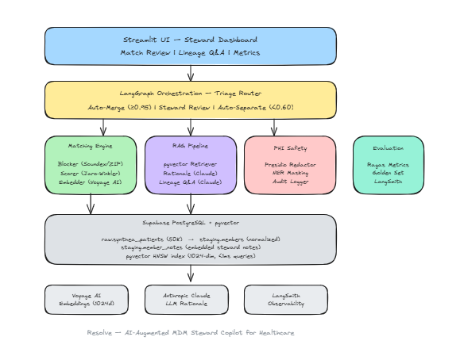
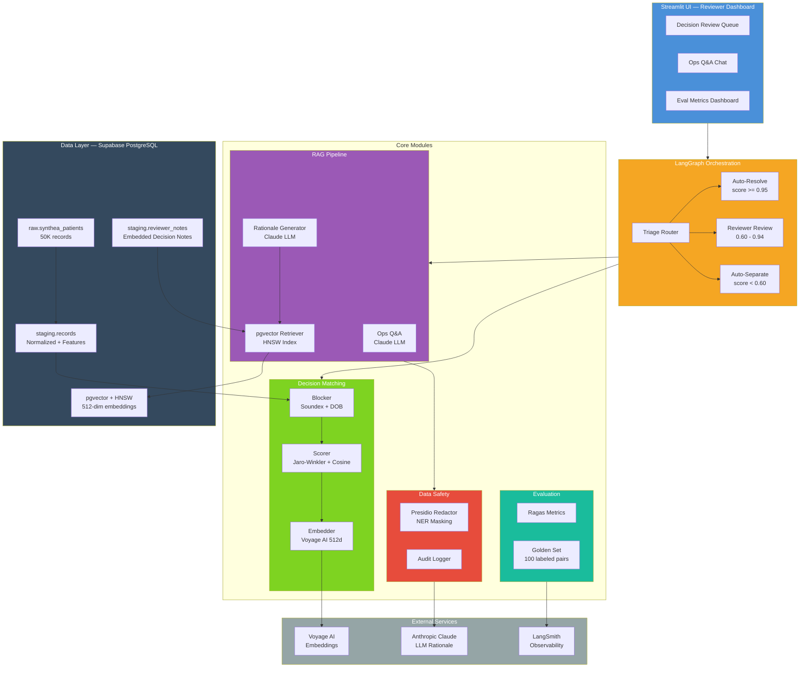

# Verify — AI Copilot for Operational Decision Review

An open-source AI copilot that helps operations teams review, explain, and audit their decisions — generating natural-language rationale for each decision and answering follow-up questions over decision history.

**Demo dataset:** Synthea synthetic healthcare records (realistic complexity: multiple identifiers, slight variations, ambiguous matches — the kinds of patterns ops teams face in finance, government services, insurance, and any regulated industry).

**Status:** Building in public over ~90 days. Foundations complete. Streamlit dashboard live.

---

## The Problem

Operations teams across regulated industries spend hours reviewing decisions, comparing records, and answering audit questions. Existing tools surface raw data or numeric scores but provide little explanation, forcing reviewers to reconstruct rationale themselves. Audit response is engineering-mediated and slow. As decision volumes grow, manual review becomes a bottleneck.

Verify augments these workflows with explainable AI rationale, conversational decision history, and proactive anomaly monitoring — without replacing the underlying systems.

---

## Two Interfaces

### 1. Decision Rationale Generator
For any pair of records, events, or decisions, Verify produces a plain-English explanation citing specific evidence. Use cases:
- Duplicate or near-duplicate detection
- Anomaly investigation ("why did this metric spike?")
- Change verification ("why was this record updated?")
- Quality flagging ("is this entry inconsistent with similar past entries?")

### 2. Ops Q&A Interface
Natural-language chat over decision history, audit logs, change events, and reviewer notes:
- "Why was decision X made last March?"
- "Show me all reviews by Sam in Q2 where the decision was overturned."
- "What changed in our data last week?"

---

## Stack

| Layer | Technology |
|-------|-----------|
| Database | PostgreSQL on Supabase + pgvector |
| Embeddings | Voyage AI (voyage-3-lite, 512-dim) |
| Orchestration | LangChain + LangGraph |
| LLM | Anthropic Claude |
| Evaluation | Ragas |
| Observability | LangSmith |
| UI | Streamlit |

---

## Architecture

View as Mermaid (text-based)

---

## Roadmap

See [`/docs/PRD.md`](docs/PRD.md) for full product spec.

Built in public — follow along on [LinkedIn](#).
