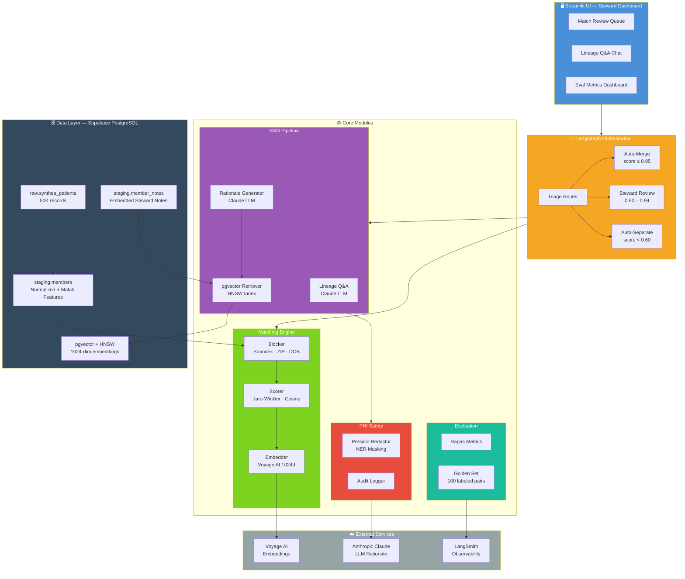

# Resolve — AI-Augmented MDM Steward Copilot

An open-source AI product that helps healthcare data stewards resolve member identity matches faster, with explainable LLM rationale and HIPAA-aware retrieval.

**Status:** Day 1 — foundation setup. Architecture, PRD, and demo coming over the next 90 days.

## Stack

- PostgreSQL on Supabase + pgvector

- Voyage AI (embeddings)

- LangChain + LangGraph (orchestration, Week 3+)

- Anthropic Claude (LLM, Week 3+)

- Ragas (RAG evaluation)

- LangSmith (observability)

- Streamlit (UI, Week 4+)

## Architecture

## Roadmap

See [`/docs/PRD.md`](docs/PRD.md) for full product spec.

Built in public — follow along on [LinkedIn](#).

